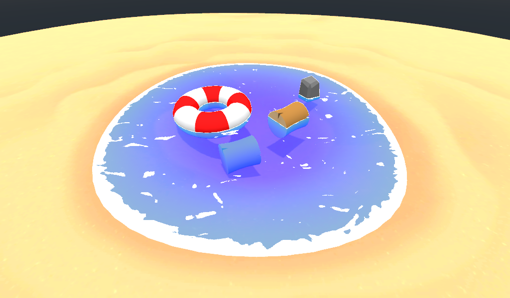

# Toon Water Shader

Ported from original Unity [Roystan's Toon Water Shader](https://roystan.net/articles/toon-water.html) to Godot 3.X

## Resources:
- Roystan's Article: https://roystan.net/articles/toon-water.html
- Miziziziz Depth Buffer: https://youtu.be/PLCGL3RW548?t=1164
