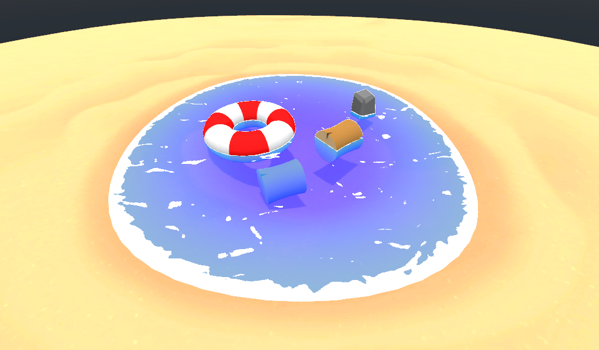

# Toon Water Shader

Ported from original Unity [Roystan's Toon Water Shader](https://roystan.net/articles/toon-water.html) to Godot 4.X

NOTE: if you have issues importing in Godot 4.3 or above, please set manually the [FBX2glTF](https://godotengine.org/fbx-import/)

## Resources:
- Roystan's Article: https://roystan.net/articles/toon-water.html
- Bastiaan Olij Depth Buffer: https://www.youtube.com/watch?v=Jq3he9Lbj7M
